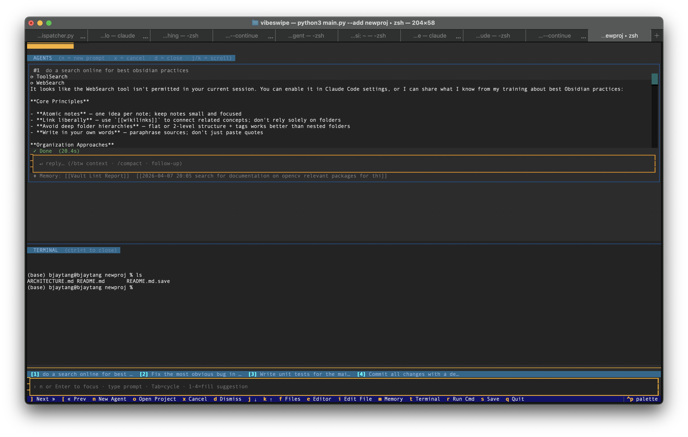

# vibe-cli

One interface to rule them all! Agent-first multiplexing CLI-style IDE. Like vim on steroids. Run Claude Code, Codex, Cursor, and OpenClaw agents across many projects simultaneously. Zero-friction context switching. Perfect for those 10x engineers with ADHD, 100+ side projects, or, if you just like CLI and terminal text-editor UIs. In usability tests, `vibe-cli` will let you achieve up to 67 APM (that's agents per minute).



## Install

```bash
make install
vibe --add ~/code/myproject ~/code/another-project
```

`make install` uses whichever `python3` is active in your shell — so activate your virtualenv or conda env first if you use one. It's equivalent to `python3 -m pip install -e .`

Or without installing:

```bash
pip install -r requirements.txt
python main.py --add ~/code/myproject ~/code/another-project
```

Requires the [Claude Code CLI](https://github.com/anthropics/claude-code) installed and on your PATH.  
Codex and Cursor CLI support is optional — the app will notify you if they're not found.

## Keys

vibe-cli is modal — like vim. Press a key to act, not to type.

### Command mode (default)

| Key | Action |
|---|---|
| `]` / `[` | Next / prev project |
| `1` – `9` | Jump to project N |
| `n` or `Enter` | Open prompt → launch agent |
| `x` | Cancel last running agent |
| `d` | Dismiss last agent widget |
| `j` / `k` | Scroll agent list down / up |
| `f` | Toggle file browser |
| `e` | Toggle file editor (read-only) |
| `i` | Enter edit mode in file editor |
| `m` | Toggle memory / knowledge graph |
| `t` | Toggle embedded terminal |
| `r` | Run last shell command detected in agent output |
| `s` | Save file (edit mode only) |
| `A` | Cycle agent type (Claude → Codex → Cursor) |
| `P` | Cycle permission mode (Safe → Accept Edits → Bypass) |
| `G` | Toggle git auto-commit+push on/off |
| `o` | Open a project directory (file picker) |
| `Backspace` / `,` | Back to command mode |
| `q` | Quit |

### Prompt mode (`n` to enter)

| Key | Action |
|---|---|
| Type freely | Build your prompt |
| `Tab` | Cycle through suggestions |
| `1`–`4` | Fill suggestion N into the input |
| `Enter` | Submit → start agent |
| `Escape` / `Backspace` | Back to command mode |

### Edit mode (`i` to enter)

| Key | Action |
|---|---|
| Type freely | Edit the file |
| `Escape` | Save and exit |

### Permission prompt (appears when agent requests a tool)

| Key | Action |
|---|---|
| `◄` / `►` or `h` / `l` | Move selection between options |
| `Enter` | Confirm selected option |
| `y` | Approve immediately |
| `n` | Deny immediately |

## Features

### Multi-agent, multi-project

Each project has its own isolated set of agents, terminal, and editor state. Switching projects with `]`/`[` does **not** cancel running agents — they keep going in the background and you can switch back to check progress.

### Agent types

Press `A` to cycle between:
- **Claude** — runs `claude --print --output-format stream-json` (default)
- **Codex** — runs OpenAI Codex CLI
- **Cursor** — runs Cursor CLI

### Permission modes

Press `P` to cycle between:
- **Safe** — uses a PreToolUse HTTP hook; every tool call shows an approval prompt before Claude proceeds
- **Accept Edits** — Claude can edit files freely, other tools still ask
- **Bypass** — no permission checks (use carefully)

### Tool approval prompt

In Safe mode, a compact inline prompt appears whenever Claude wants to use a tool:

```
 Claude wants to use: Write
 src/utils.py

 ❯ Approve      Approve+Remember      Deny
 ◄/► select  Enter=confirm  y=approve  n=deny
```

**Approve+Remember** writes the tool to `.claude/settings.local.json` so it's auto-allowed on future runs.

### Real embedded terminal

Press `t` to open a full PTY shell (pyte + ptyprocess) — the same as a VS Code terminal, not a fake input box. Each project gets its own persistent terminal session. Press `ctrl+t` or `Escape` to close.

### Auto-commit+push

Disabled by default. Press `G` in command mode to toggle on/off at runtime.

When enabled, after each successful agent run in a git repo, vibe-cli stages all changes, commits, and pushes:
```
[VibeCLI] <your prompt>
```
Customise the prefix with `"git": { "commit_message_prefix": "[VibeCLI] " }` in `config.json`. To enable permanently, set `"git": { "auto_commit": true }` in `config.json`.

### Predictive suggestions

The prompt bar shows up to 4 ranked suggestions based on:
1. A weighted transition graph of your past prompts per project (personalization)
2. An LLM-generated profile updated after each run
3. File-extension hints (`.py` → pytest suggestions, etc.)

After each successful run, the app updates your vault, MOCs, the lint report, and your usage profile in the background.

### Obsidian-style memory vault

Every agent run is saved as a timestamped markdown note in `vault/`. Notes are linked via `[[wikilinks]]` and organized into Maps of Content (MOCs). Press `m` to browse the knowledge graph as a navigable tree, then `Enter` to open a note in the editor.

A vault linter runs automatically and writes broken links, orphan notes, and stale MOCs to `vault/meta/lint_report.md`.

## Config

```json
{
  "claude": {
    "model": "claude-sonnet-4-6",
    "permission_mode": "accept_edits"
  },
  "vault": { "root": "vault" },
  "git": {
    "auto_commit": true,
    "commit_message_prefix": "[vibe-cli] "
  },
  "ui": {
    "max_agents_per_project": 8,
    "suggestions_count": 4
  }
}
```

## Add a project

```bash
# On startup
python main.py --add ~/code/myapp ~/code/api

# Or press o inside the app to open a directory picker
```

## Manual

A full man page is included covering all key bindings, slash commands, agents, permission modes, configuration options, vault layout, and more.

```bash
make install-man   # installs to /opt/homebrew/share/man/man1/
man vibe
```

Or read it without installing:

```bash
man ./man/vibe.1
```

## Tests

```bash
make dev   # installs pytest + pytest-asyncio
make test
```
